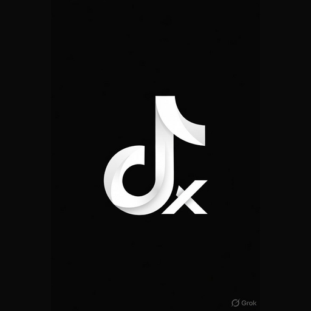

# MuSicX

### YouTube Music client for Android — supercharged.

 

 

[**Download**](#download-now) · [**Features**](#features) · [**What's New**](#whats-new-in-musicx) · [**Roadmap**](#roadmap) · [**FAQ**](#faq)

> [!NOTE]
> **MuSicX** is a maintained fork of [Metrolist](https://github.com/MetrolistGroup/Metrolist) with additional integrations (Spotify, SponsorBlock, crash reporting) and feature ports from [meld](https://github.com/AudreyProject/meld). Same great UX, more music sources, more resilience.

> [!WARNING]
> **Regional Restriction** — If YouTube Music is unavailable in your region, this app will not work without a **VPN or proxy** connecting to a supported region.

---

<h1>Screenshots</h1>

---

<h1>What's New in MuSicX</h1>

Features added on top of Metrolist upstream:

| Feature | Status | Notes |
|---|---|---|
| 🟢 **Spotify integration** | Shipped | Log in with your own Spotify account via in-app WebView (uses `sp_dc` cookie — no client secret needed). Home, Library, Search & Now-Playing hooks bridge tracks to YouTube Music equivalents. |
| 🟢 **SponsorBlock** | Shipped | Auto-skip sponsor segments and non-music intros/outros in videos, powered by the [SponsorBlock](https://sponsor.ajay.app) community API. |
| 🟢 **Crash reporting to GitHub Issues** | Shipped | Unhandled crashes are packaged (device info + sanitized stacktrace) and opened as GitHub Issues automatically, so bugs never get lost. |
| 🟢 **ANR Watchdog** | Shipped | Detects UI freezes ≥ 5s and captures a stack dump for diagnostics — inspired by meld. |

 

<h1>Roadmap — Coming Soon</h1>

Features currently being ported from [meld](https://github.com/AudreyProject/meld):

| Planned Feature | Priority | Description |
|---|---|---|
| 🎵 **Music-Recognition Widget** | P1 — Next | Shazam-powered home-screen widget + alarm-time recognition. |
| 📝 **LyricsPlus / ExperimentalLyrics** | P1 | Richer lyric providers, karaoke-style word timing, translation overlays. |
| 🎙️ **Podcasts** | P1 | Native podcast browsing, subscriptions, episode player + progress sync. |
| 💿 **Qobuz** | P2 | Hi-res streaming integration (bring-your-own account). |
| 🎨 **New Player Design** | P2 | Redesigned Now-Playing screen with minimal / immersive variants. |

> Want a feature bumped? Open an issue or vote on existing ones.

---

<h1>Full Feature List</h1>

<table>
  <tr>
    <td width="50%" valign="top">

#### Playback
- Stream any song or video from YouTube Music
- Background playback
- Download & cache for offline use
- Skip silence
- Sleep timer
- **SponsorBlock — skip sponsor/intro segments** ✨

</td>
    <td width="50%" valign="top">

#### Audio
- Audio normalization
- Tempo & pitch control
- Equalizer

</td>
  </tr>
  <tr>
    <td width="50%" valign="top">

#### Lyrics & Discovery
- Live synced lyrics
- AI-powered lyrics translation
- Personalized quick picks
- Search songs, albums, artists, videos, and playlists

</td>
    <td width="50%" valign="top">

#### Library & Account
- Full library management
- Local playlists
- Import playlists
- Reorder songs in playlist or queue
- YouTube Music account login
- **Spotify login — sync liked songs, playlists & recent tracks** ✨
- Sync songs, artists, albums, and playlists

</td>
  </tr>
  <tr>
    <td width="50%" valign="top">

#### Social
- Listen together with friends in real-time

</td>
    <td width="50%" valign="top">

#### Interface
- Home screen widget
- Light / Dark / Black / Dynamic theme modes
- Dynamic color + 19 preset color palettes
- Built with Material 3

</td>
  </tr>
  <tr>
    <td width="50%" valign="top">

#### Reliability ✨
- **ANR Watchdog** — auto-detects UI freezes
- **Crash reporter** — one-tap submit to GitHub Issues

</td>
    <td width="50%" valign="top">

#### Coming Soon
- Music-Recognition Widget
- Podcasts
- Qobuz (hi-res)
- LyricsPlus / ExperimentalLyrics
- New Player Design

</td>
  </tr>
</table>

---

<h1>Download Now</h1>

<h2>Stable Release</h2>

<table>
  <tr>
    <th align="center">GitHub</th>
    <th align="center">Obtainium</th>
  </tr>
  <tr>
    <td align="center">
      
    </td>
    <td align="center">
      
    </td>
  </tr>
</table>

<h2>Nightly Build</h2>

<table>
  <tr>
    <th align="center">GitHub Nightly (foss)</th>
    <th align="center">GitHub Nightly (with Google Cast)</th>
  </tr>
  <tr>
    <td align="center">
      
    </td>
    <td align="center">
      
    </td>
  </tr>
</table>

---

<h1>FAQ</h1>

<strong>Is my Spotify password sent anywhere?</strong>

No. Spotify login happens in an in-app WebView pointing to Spotify's real login page. MuSicX only captures the `sp_dc` cookie locally to call the Spotify Web API on your behalf. Nothing leaves your device except direct Spotify API calls.

<strong>What data does the crash reporter send?</strong>

Only when a crash occurs and you tap "Report": sanitized stacktrace, app version, Android version, device model. No account tokens, no personal data.

<strong>How is MuSicX different from Metrolist?</strong>

MuSicX is a fork focused on adding: Spotify integration, SponsorBlock, ANR watchdog, crash reporting, and (in progress) music recognition widget, podcasts, Qobuz, new lyric providers, and a redesigned player. Upstream Metrolist features are preserved and merges are kept clean.

---

<h1>Special Thanks</h1>

<h3>MuSicX stands on the shoulders of incredible open-source work.</h3>

<h3>Main Inspirations</h3>

<table>
  <thead>
    <tr>
      <th align="center">Project</th>
      <th align="center">Authors</th>
    </tr>
  </thead>
  <tbody>
    <tr>
      <td align="center"><strong><a href="https://github.com/MetrolistGroup/Metrolist">Metrolist</a></strong></td>
      <td align="center"><a href="https://github.com/mostafaalagamy">Mo Agamy</a> — the upstream base of MuSicX</td>
    </tr>
    <tr>
      <td align="center"><strong><a href="https://github.com/AudreyProject/meld">meld</a></strong></td>
      <td align="center">Feature ports (Spotify hooks, SponsorBlock, ANR, CrashReporter, upcoming podcasts/Qobuz/new player)</td>
    </tr>
    <tr>
      <td align="center"><strong>InnerTune</strong></td>
      <td align="center"><a href="https://github.com/z-huang">Zion Huang</a> · <a href="https://github.com/Malopieds">Malopieds</a></td>
    </tr>
    <tr>
      <td align="center"><strong>OuterTune</strong></td>
      <td align="center"><a href="https://github.com/DD3Boh">Davide Garberi</a> · <a href="https://github.com/mikooomich">Michael Zh</a></td>
    </tr>
  </tbody>
</table>

<h3>Libraries & Integrations</h3>

<table>
  <thead>
    <tr>
      <th align="center">Project</th>
      <th align="center">Contribution</th>
    </tr>
  </thead>
  <tbody>
    <tr>
      <td align="center"><a href="https://sponsor.ajay.app"><strong>SponsorBlock</strong></a></td>
      <td>Crowdsourced sponsor / intro / outro segment skipping</td>
    </tr>
    <tr>
      <td align="center"><a href="https://better-lyrics.boidu.dev"><strong>Better Lyrics</strong></a></td>
      <td>Time-synced lyrics with word-by-word highlighting & YouTube Music integration</td>
    </tr>
    <tr>
      <td align="center"><a href="https://github.com/aleksey-saenko/MusicRecognizer"><strong>MusicRecognizer</strong></a></td>
      <td>Music recognition feature & Shazam API integration (upcoming)</td>
    </tr>
    <tr>
      <td align="center"><a href="https://github.com/Spotube/Spotube"><strong>Spotube</strong></a></td>
      <td>Inspiration for the cookie-based Spotify auth flow</td>
    </tr>
  </tbody>
</table>

<h3>We also thank the entire open-source community — for every library, tool, and API that powers this project.</h3>

---

<h1>Contributors</h1>

---

<h1>Disclaimer</h1>

This project is **not affiliated with, funded, authorized, endorsed by, or in any way associated** with YouTube, Google LLC, Spotify AB, Qobuz, Metrolist Group LLC, meld, or any of their affiliates and subsidiaries.

All trademarks, service marks, and intellectual property rights referenced in this project belong to their respective owners.

---

 

**MuSicX — maintained by [ufoptg](https://github.com/ufoptg)**
**Built on the shoulders of [Metrolist](https://github.com/MetrolistGroup/Metrolist) by [Mo Agamy](https://github.com/mostafaalagamy)**

